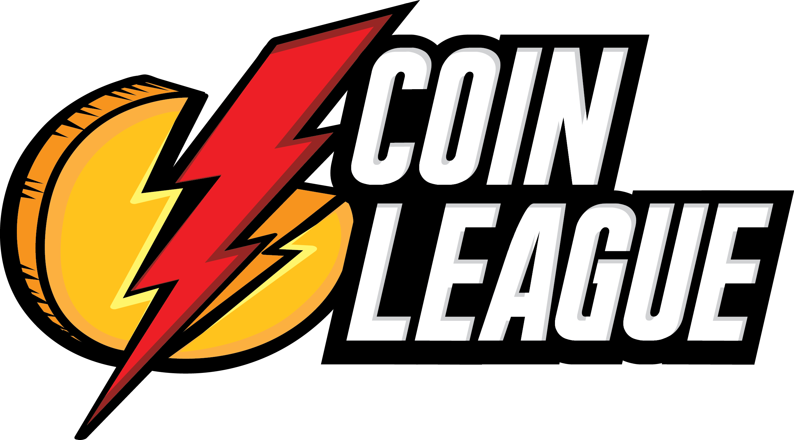

# 🏆 Coin League

<div align="center">
  
  <h3>The Ultimate Blockchain Price Racing Game</h3>
</div>

## 🎮 Overview

Coin League is an exciting blockchain-based game where players compete in price prediction races. Test your crypto market knowledge, compete with other players, and climb the leaderboard while having fun!

## ✨ Features

- **Real-time Price Racing**: Compete in real-time races based on cryptocurrency price movements
- **Multiple Game Modes**: Choose between different racing formats and timeframes
- **Global Leaderboard**: Climb the ranks and become a legendary price predictor
- **Blockchain Integration**: Secure, transparent, and decentralized gameplay
- **Social Features**: Challenge friends and join communities
- **Achievement System**: Earn rewards for your victories

## 🚀 Getting Started

### Prerequisites

- Node.js 18.0 or higher
- npm or yarn
- A Web3 wallet (or social profile)

### Installation

1. Clone the repository:
```bash
git clone https://github.com/DexKit/dexkit-monorepo.git
cd apps/coinleague
```

2. Install dependencies:
```bash
npm install
# or
yarn install
```

P.S:  we recommend yarn for better dependencies management

3. Set up environment variables:
```bash
cp .env.example .env.local
```
Edit `.env.local` with your configuration.

4. Start the development server:
```bash
npm run dev
# or
yarn dev
```

Visit `http://localhost:3000` to start playing!

## 🎯 How to Play

1. **Connect Wallet**: Link your Web3 wallet to get started
2. **Choose or create a Race**: Select from available price prediction races or create your own
3. **Make Your Predictions**: Predict whether the price will go up or down
4. **Compete**: Race against other players in real-time
5. **Win & Earn**: Climb the leaderboard and earn rewards

## 🛠 Tech Stack

- Next.js with App Router
- TypeScript
- Material-UI (MUI)
- Real-time Data Feeds
- Custom Blockchain Smart Contracts

## 🤝 Contributing

We welcome contributions! Please see our [Contributing Guidelines](CONTRIBUTING.md) for details.

## 📜 License

This project is licensed under the MIT License - see the [LICENSE](LICENSE) file for details.

## 🔗 Links

- [Official Game ebsite](https://coinleague.org)
- [Official Game ebsite](https://coinleague.xyz)
- [Documentation](https://docs.coinleague.org)
- [Discord Community](https://discord.gg/qnwVzgncXd)
- [X / Twitter](https://x.com/Coin__League)

---

<div align="center">
  Made with ❤️ by <a href="https://dexkit.com">DexKit</a>
</div>
